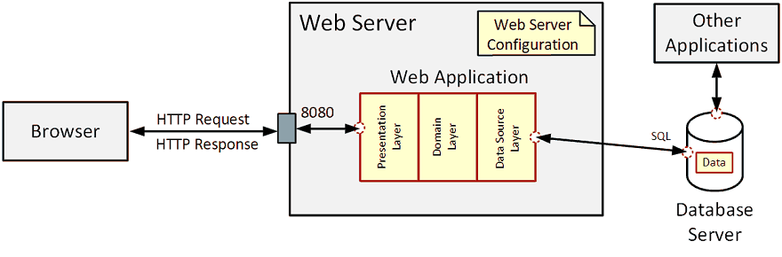
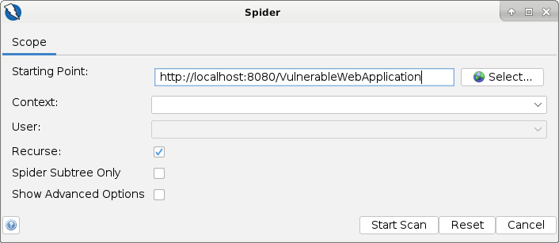
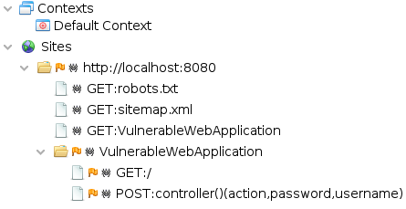
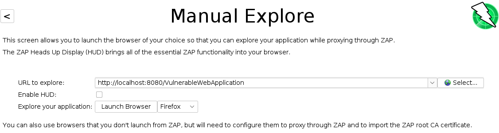
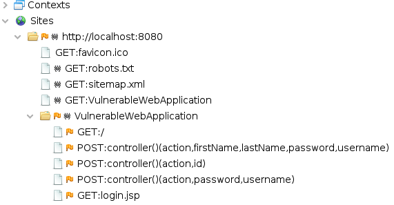

# Attack Surface Analysis

Remember, the attack surface is the sum of all **paths for data and commands into and out (entry and exit points)** 
of the application as well as all **valuable data (assets)** used in the application.

Also, we focus on different types of users - at least: **anonymous users** and **admin users**.

## Mapping the Attack Surface

We start with a simple picture of the system:



The figure shows that the web application has an **entry point** (HTTP port 8080) and an **exit point** (database connection).
Also interesting is the fact that the **assets** are outside the application, namely in the database.
This is critical because the database can be used by other applications (with the correct access data).

We want to examine the entry point more closely. Specifically, we want to know which web pages are provided by the 
application and which data the user can enter. 
We use a **web spider** for this.


### Web Application Spider

We use **OWASP ZAP** to explore the web application's surface.
ZAP is an **interception proxy** which records all interactions between the browser and the web application.

```
$ cd ZAP_2.10.0/
$ ./zap.sh 
```


#### Automated Spider

An automated spider works **like a web crawler** starting from a given page and following all links to search for
documents.
We start with the web application's main page:

URL: http://localhost:8080/VulnerableWebApplication



From the given URL, the automated spider visites all linked pages of the web application.



Because ZAP was not able to login, the crawling process stops early.

#### Manual Spider 

To start the manual spider we have to provide an initial URL tigether with a Browser we want to use.


 
The manual spider needs a **user to interact with the web application** while the ZAP proxy is recording HTTP
requests.
Based on these recordings, a map of sites is generated showing the used **HTTP methods and their parameters**.



As we can see from the results, this is the **more effective** way to analyze a web application.
The user can provide the right data (e.g. authentication) and executes the existing workflows in a proper way.

### Accessing the Database
As we know from the setup, we can use an SQL client to connect to the database and read out the data.
```
MariaDB [testdb]> select * from user;
+----+-----------+----------+----------+--------------+
| id | firstname | lastname | username | password     |
+----+-----------+----------+----------+--------------+
|  1 | student   | student  | student  | c3R1ZGVudA== |
+----+-----------+----------+----------+--------------+
1 row in set (0.226 sec)
```
In a productive environment, access to the database is prevented by a firewall. In principle, however, an attacker 
could access the database via a faulty application.

## References
* [OWASP Zed Attack Proxy (ZAP)](https://www.zaproxy.org/)
* [ZAP Getting Started](https://www.zaproxy.org/getting-started/)

* [Youtube: ZAP Deep Dive: Introduction to ZAP](https://youtu.be/CxjHGWk4BCs)
* [Youtube: ZAP Deep Dive: Exploring with the Standard Spider](https://youtu.be/mz2nhYpU-sw) 

*Egon Teiniker, 2019-2021, GPL v3.0*