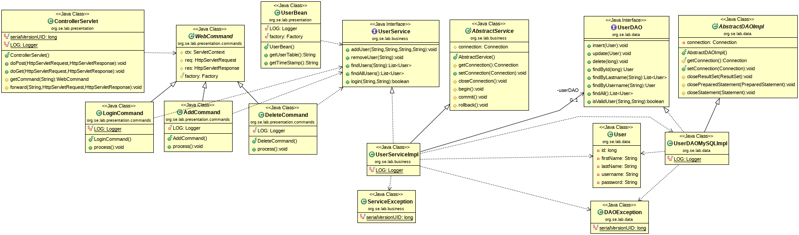

# Vulnerable Web Application

## Setup

#### Database Server
Start the MySQL server (as student):
```
[student@localhost ~]$ sudo systemctl start mariadb.service 
```
 
Start a MySQL client (as student):
```
$ mysql -u student -p
Enter password: student
MariaDB [(none)]> use testdb;
MariaDB [testdb]> show tables;

MariaDB [testdb]> source sql/createUser.sql;	
```

#### Application Server

Start Wildfly in a terminal (as student):
```
$ cd install/wildfly-x.y.z.Final
$ bin/standalone.sh
```

#### Deploy the Web Application

Within the project directory invoke maven:
```
$ cd github/teiniker-lectures-securedesign/risk-analysis/VulnerableWebApplication
$ mvn wildfly:deploy
```

#### Access the Web Application

Type the following URL into your browser:

```
URL: http://localhost:8080/VulnerableWebApplication
```

To log in, use username=student password=student ;-)


## Black-Box Testing
Try to attack the given Web application from the outside using common
penetration testing techniques and tools.

### OWASP ZAP

To perform a first quick test we start the OWASP ZAP proxy, enter the 
desired **URL** and press the **Attack** button.


### Manual Tests

#### URL: http://localhost:8080/VulnerableWebApplication/login.jsp

* **SQL Injection (SQLi)** to bypass authentication: 
```
password: ' OR 1 #
```

* **Reflected Cross Site Scripting (XSS)**
```
username: <script>alert("XSS");</script>
password: xxx
```


* **No HTTPS** 
    
    All data is sent in plain text from the browser to the web application.

* **Direct Object References**
```
http://localhost:8080/VulnerableWebApplication/table.jsp
```
    

* **GET Request**
 
    Browser: change <form method="POST" ...> to <form method="GET" ...>


* **Database** 

    Password stored in Base64 (without hashing)
```
    +----+-----------+----------+----------+--------------+
    | id | firstname | lastname | username | password     |
    +----+-----------+----------+----------+--------------+
    |  1 | student   | student  | student  | c3R1ZGVudA== |
    +----+-----------+----------+----------+--------------+
```
    


#### URL: http://localhost:8080/VulnerableWebApplication/table.jsp

* **Reflected Cross Site Scripting (XSS)**
```
FirstName: <script>alert("XSS");</script>
LastName: <script>alert("XSS");</script>
username: <script>alert("XSS");</script>
```

### Architectural Decomposition

In order to be able to carry out a more detailed analysis, it is 
necessary to dissect the architecture of the web application into its 
parts. 



The given class diagram provides an overview of the architectural 
patterns involved.


