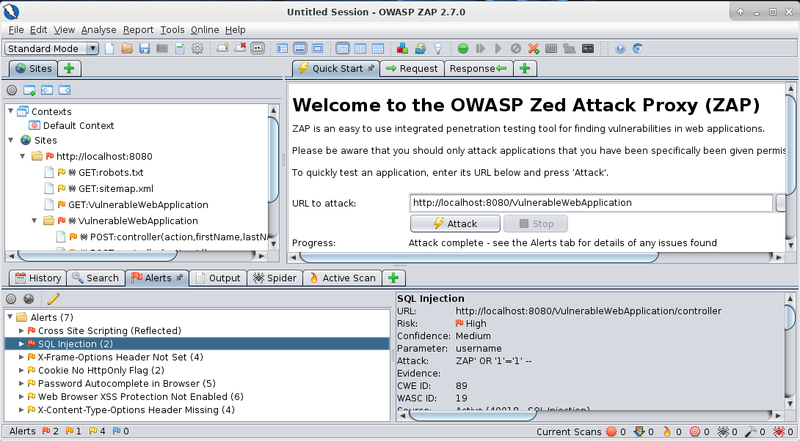
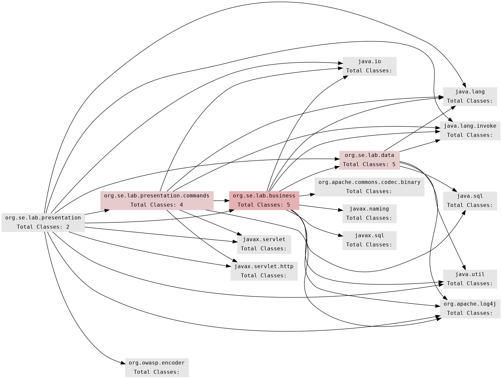
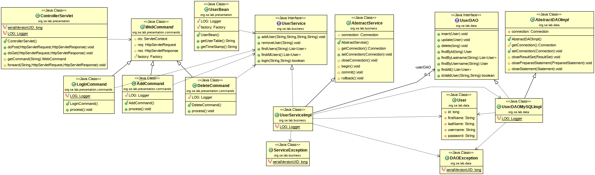

# Finding Threats

A popular approach to find threats is to carry out the **OWASP Top 10 attacks**. 
This can be done automatically (active scanner) or manually. 
The aim is to find out whether there are any weak points in the web application.

### Active Scanning

To perform a first quick test we start the active scanner of the **OWASP ZAP** proxy, enter the 
desired **URL** and press the **Attack** button.



### Manual Tests

URL: http://localhost:8080/VulnerableWebApplication/login.jsp

* **SQL Injection (SQLi)** to bypass authentication: 
    ```
    username: student' #

    username: ' OR 1 #
    ```

* **Reflected Cross Site Scripting (XSS)**
    ```
    username: <script>alert("XSS");</script>
    password: xxx
    ```

* **No HTTPS** 

    All data is sent in plain text from the browser to the web application.


* **Direct Object References**
    ```
    http://localhost:8080/VulnerableWebApplication/table.jsp
    ```
    

* **GET Request**

    Browser: change <form method="POST" ...> to <form method="GET" ...>


* **Database** 

    Password stored in Base64 (without hashing)
```
    +----+-----------+----------+----------+--------------+
    | id | firstname | lastname | username | password     |
    +----+-----------+----------+----------+--------------+
    |  1 | student   | student  | student  | c3R1ZGVudA== |
    +----+-----------+----------+----------+--------------+
```
    


URL: http://localhost:8080/VulnerableWebApplication/table.jsp

* **Stored Cross Site Scripting (XSS)**
    ```
    FirstName: <script>alert("XSS");</script>
    LastName: <script>alert("XSS");</script>
    username: <script>alert("XSS");</script>
    ```

* **Missing Input Validation**
    Try to enter mor than 255 characters for FirstName, LastName, and username...
 

### Architectural Decomposition

In order to be able to carry out a more detailed analysis, it is 
necessary to dissect the architecture of the web application into its 
parts. 

As a first step we analyze the **dependencies between packages**:


In a second step, we use the **class diagram** provides to get an overview of 
the architectural- and design patterns involved.



After potential **paths from the entry points to the assets** have been found in the models, 
these paths are examined at the source code level.
We have to check which improvements in the design and in the implementation can be carried 
out so that the attacks are no longer possible.

Note that finding paths from the entry points to possible vulnerabilities is 
a **manual activity** that can take a lot of time for larger applications.

*Egon Teiniker, 2019-2021, GPL v3.0*