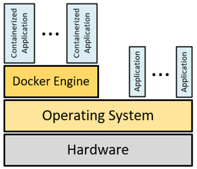

# Introduction to Docker

A **Docker image** contains all the code and dependencies. 

The Docker image can run in any Docker environment. 
The runtime environment of the Docker image is called a **Docker container**. 

Docker uses **resource isolation**, like how processes are isolated 
in the operating system kernel to **run multiple containers** on the 
**same operating system**.



Either we build a Docker image or pull the already pre-built Docker image 
from a **Docker registry**. The Docker registry stores Docker images. 
The default Docker registry is **Docker Hub**.

To create a Docker image, we create a **Dockerfile** which contains all 
the other images, dependencies, and commands.


## Using Docker Containers

On our Linux VM the **Docker Engine** (dockerd) is not started automatically to conserve 
resources. Enable and start it with systemd:

```bash
$ sudo systemctl start docker
$ sudo systemctl status docker

$ docker version
$ docker info

$ sudo systemctl stop docker
```

A **Docker Image** is a read-only template that contains an application 
and all of its dependencies, configuration, and metadata. 
Images are built from **Dockerfiles** or pulled from a registry (**Docker Hub**) 
and are identified by a repository name and an optional tag (repo:tag, 
default tag is `latest`). 

The following commands are used in the context of Docker images:

```bash
$ docker image help
Commands:
  build       Build an image from a Dockerfile
  history     Show the history of an image
  import      Import the contents from a tarball to create a filesystem image
  inspect     Display detailed information on one or more images
  load        Load an image from a tar archive or STDIN
  ls          List images
  prune       Remove unused images
  pull        Pull an image or a repository from a registry
  push        Push an image or a repository to a registry
  rm          Remove one or more images
  save        Save one or more images to a tar archive (streamed to STDOUT by default)
  tag         Create a tag TARGET_IMAGE that refers to SOURCE_IMAGE
```


A **Docker Container** is an instance of a Docker image running as a process.
There are also container specific commands we can use:

```bash
$ docker container help
Commands:
  attach      Attach local standard input, output, and error streams to a running container
  commit      Create a new image from a container's changes
  cp          Copy files/folders between a container and the local filesystem
  create      Create a new container
  diff        Inspect changes to files or directories on a container's filesystem
  exec        Run a command in a running container
  export      Export a container's filesystem as a tar archive
  inspect     Display detailed information on one or more containers
  kill        Kill one or more running containers
  logs        Fetch the logs of a container
  ls          List containers
  pause       Pause all processes within one or more containers
  port        List port mappings or a specific mapping for the container
  prune       Remove all stopped containers
  rename      Rename a container
  restart     Restart one or more containers
  rm          Remove one or more containers
  run         Run a command in a new container
  start       Start one or more stopped containers
  stats       Display a live stream of container(s) resource usage statistics
  stop        Stop one or more running containers
  top         Display the running processes of a container
  unpause     Unpause all processes within one or more containers
  update      Update configuration of one or more containers
  wait        Block until one or more containers stop, then print their exit codes
```


## Docker Hub

A **Docker Repository** is a named bucket of Docker images.
A repository's name is made up of the name of the host where the image is located, 
the user account that owns the image, and a short name.
As there can be several versions of software, a repository can hold several images.
Each of the images in a repository is identified uniquely with tags.
A repository name and tag form a composite key.

**Docker Indexes** are search engines that catalog repositories.
There are several public indexes, but by default Docker is integrated with an index named **Docker Hub**: 
`https://hub.docker.com`

Docker Hub makes Docker more useful out of the box.

We can use the following command to **search the index**:

```bash
$ docker search alpine
+NAME                DESCRIPTION                                     STARS     OFFICIAL
alpine              A minimal Docker image based on Alpine Linux…   11400     [OK]
alpine/git          A  simple git container running in alpine li…   244       
alpine/socat        Run socat command in alpine container           112       
alpine/helm         Auto-trigger docker build for kubernetes hel…   69        
alpine/curl                                                         11        
alpine/k8s          Kubernetes toolbox for EKS (kubectl, helm, i…   63        
alpine/httpie       Auto-trigger docker build for `httpie` when …   21        
alpine/bombardier   Auto-trigger docker build for bombardier whe…   28        
alpine/terragrunt   Auto-trigger docker build for terragrunt whe…   17        
alpine/openssl      openssl                                         7         
alpine/flake8       Auto-trigger docker build for fake8 via ci c…   2         
alpine/psql         psql — The PostgreSQL Command-Line Client       4         
alpine/kubectl      Kubernetes command-line tool for managing cl…   0         
alpine/ansible      run ansible and ansible-playbook in docker      27        
alpine/semver       Docker tool for semantic versioning             4         
alpine/jmeter       run jmeter in Docker                            9         
alpine/java         Repo containing the build scripts to produce…   4         
alpine/mongosh      mongosh - MongoDB Command Line Database Tools   2         
alpine/xml          several xml tools to work on xml file as jq …   1         
alpine/mysql        mysql client                                    6         
alpine/bundle       This repository has been archived by the own…   1         
alpine/gcloud       Auto-trigger docker build for gcloud (google…   0         
alpine/cfn-nag      Auto-trigger docker build for cfn-nag when n…   0         
alpine/crane                                                        0         
alpine/dfimage      reverse Docker images into Dockerfiles          70     
```


## References
* [Docker Homepage](https://www.docker.com/)
* [Docker Engine](https://docs.docker.com/engine/)

* Jeff Nickoloff. **Docker in Action**. Manning, 2016 

* Richard Bullington-McGuire, Andrew K. Denis, Michael Schwartz. **Docker for Developers**. Packt Publishing, 2020.

* SK. Singh. **Cloud Computing and AWS Introduction: Docker | AWS Cloud Platform | Serverless Computing | Virtualization | Virtual Machine | Hypervisor | IaaS | PaaS | SaaS | FaaS | DaaS | EC2 | IAM | S3**. Independently published, 2021

* [Best practices for writing Dockerfiles](https://docs.docker.com/develop/develop-images/dockerfile_best-practices/)


*Egon Teiniker, 2017-2026, GPL v3.0*
