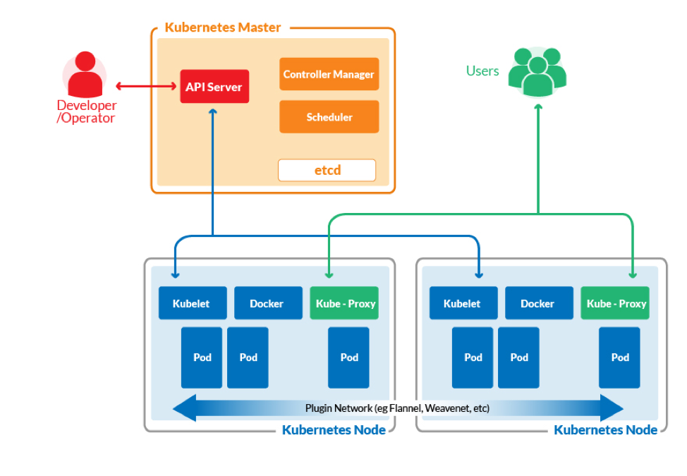

# From Docker to Kubernetes

Traditionally, cloud service providers used **virtual machines** to isolate running applications from one another.
A hypervisor, or host operating system, provides virtual CPU, memory and other resources to many guest operating 
systems. 
Each guest OS works as if it is running on an actual physical hardware and it is, unaware of other guests running 
on the same physical server.

On the other hand, when we run **containerized applications**, we virtualize the operating system (your standard 
libraries, packages, etc.) itself, not the hardware.
You can run multiple applications and impose limitations on their resource utilization if you want.
Each application will run unaware of the many other containers it is running alongside.
 
## Docker

Docker is a **standalone software** that can be installed on any computer to **run containerized applications**. 
Containerization is an approach of running applications on an OS such that the **application is isolated** from the rest of the system.
We can see Docker as a **software packaging and delivery** platform.

**Docker can be installed on any OS**; even Windows and Mac OS X are well-supported. 
So you can package your code into a Docker image, run and test it locally using Docker to guaranteed that 
the containers that were created from that Docker image will behave the same way in production.
All the **dependencies**, such as the version of programming language, standard library, etc., are all contained within that image.
 
If you are adopting a **microservices-based architecture** for your software you should definitely use Docker containers 
for each microservice.
The technology is quite mature and very little can be said against it.
Try avoiding monolithic designs and go for microservices if you actually want to make use of containerization platform.
 
**Automated builds** are a lot easier thanks to **Dockerfiles**. 
Complex multi-container deployments are now standardized thanks to **Docker-Compose**. 
Software engineers provide complete CI/CD solutions involving building and testing Docker images and managing public or 
private Docker registries.
 
## Docker Compose

Compose is a tool for **defining and running multi-container Docker applications**. 
With Compose, you use a **YAML file** to configure your application’s services. 
Docker Compose is designed from the ground up to simplify the deployment of microservices, with a single command, 
you create and start all the services from your configuration.

Docker Compose is designed to run on a **single host or cluster**, while Kubernetes is more agile in incorporating multiple 
cloud environments and clusters.  
 
## Kubernetes
Kubernetes automates the process of scaling, managing, updating and removing containers. 
Kubernetes is a **container orchestration platform**, while Docker is at the heart of the containerization, 
it enables us to have containers in the first place.

In principle, Kubernetes can work with any containerization technology. 
Two of the most popular options that Kubernetes can integrate with are **rkt** and **Docker**.
Kubernetes allows us to **run containers across multiple compute nodes** (these can be VMs or a bare-metal servers). 
Once Kubernetes takes control over a cluster of nodes, **containers can then spun up or torn down** depending upon our need at any given time.

There are two basic concepts worth knowing about a Kubernetes cluster: 
* The first is **Node**. This is a common term for VMs and/or bare-metal servers that Kubernetes manages. 
* The second term is **Pod**, which is a basic unit of deployment in Kubernetes. A pod is a collection of related Docker 
  containers that need to coexist.

There are two types of Nodes: 
* One is the **Master Node**, where the heart of Kubernetes is installed.
  The master node’s job is to make sure that the desired state of the cluster is maintained. 
* The Maser Node controls the scheduling of Pods across various **Worker Nodes** (a.k.a just Nodes), where your 
  application actually runs. 
  
On Kubernetes Master Node we have:
* **Controller Manager**: This is responsible for taking into account the current state of the cluster (e.g, X number of 
  running Pods) and making decisions to achieve the desired state (e.g, having Y number of active Pods instead). 
  It listens on API Server for information about the state of the cluster
* **API Server**: It is used by WebUI dashboards and command-line utility like kubeclt. These utilities are in turn used by 
   human operators to interact with the Kubernetes cluster.
* **Scheduler**: This is what decides how events and jobs would be scheduled across the cluster depending on the availability 
  of resources, policy set by operators, etc. It also listens on API Server for information about the state of the cluster.
* **etcd**: This is the “storage stack” for the Kubernetes Master Nodes. It uses key-value pairs and is used to save policies, 
  definitions, secrets, state of the system, etc. 
 
On a Kubernetes Worker Node we have:
* **Kubelet**: This relays the information about the health of the Node back to the Master as well as execute instructions 
  given to it by Master Node.
* **Kube-Proxy**: This network proxy allows various microservices of your application to communicate with each other, within 
  the cluster, as well as expose your application to the rest of the world, if you so desire. 
  Each Pod can talk to every other Pod via this proxy.
* **Docker**: Each Node has a docker engine to manage the containers. 
 
There are **cloud-hosted Kubernetes platforms** that organizations can use to run their applications.  
The worldwide availability of hosted data centers can actually help you to get the most out of the distributed nature of Kubernetes.
Thus, you don’t have to worry about maintaining the cluster.

Kubernetes has freed containers from being stuck on a single computer, making cloud an ever more enticing a place for this technology. 
**Containerization will become the norm for every cloud dependent service**. 
Therefore, it’s important to adopt this technology earlier rather than later. Doing so would minimize migration costs and 
associated risks.
  
 
## References
* [From Docker Compose to Kubernetes](https://caylent.com/from-docker-compose-to-kubernetes)
* [Kubernetes vs. Docker: A Primer](https://containerjournal.com/topics/container-ecosystems/kubernetes-vs-docker-a-primer/)
* [Kubernetes](https://kubernetes.io/docs/home/)

*Egon Teiniker, 2021-2022, GPL v3.0*
