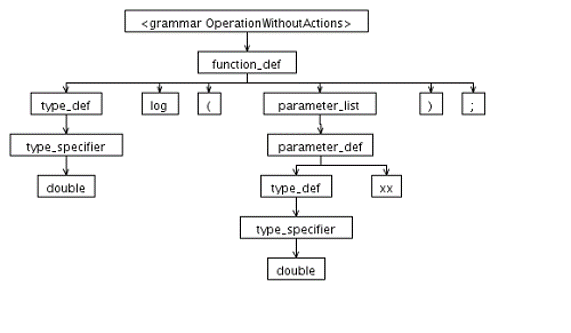
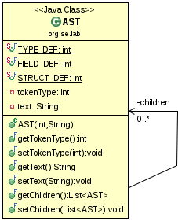
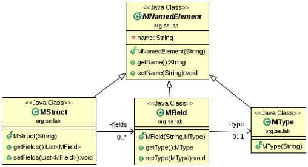
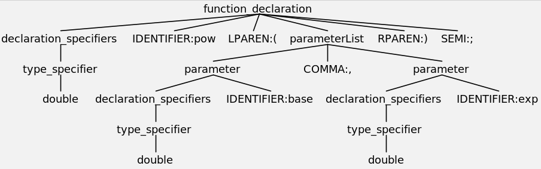
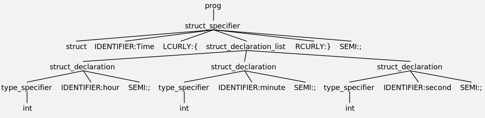

# ANTLR 4 Grammar Examples

**ANTLR (ANother Tool for Language Recognition)** is a powerful parser generator for reading, processing, 
executing, or translating structured text or binary files. 
It's widely used to build languages, tools, and frameworks. 

From a grammar, ANTLR generates a parser that can build and walk parse trees.

We use ANTLR to investigate how **source code can be transformed into an abstract model**.

## Lexical Analysis
Lexical analysis is also known as **scanning**.
A scanner reads characters and groups them into **tokens**, which are the 
smallest meaningful units of a program.

The principal purpose of the scanner is to **simplify the task of the parser**, 
by reducing the size of the input (there are many more characters than tokens) 
and by removing characters like white space.

Tokens come in many kinds, including keywords, identifiers, symbols, and constants 
of various types. To specify tokens, we use the notation of **regular expressions**.

### Regular Grammars
It is preferable to build a scanner in a structured way, as an explicit representation 
of a **finite automaton**.
Finite automata can be generated automatically from a set of regular expressions, 
making it easy to regenerate a scanner when token definitions change.

Regular expressions constitute a declarative language for a limited problem domain, 
namely that of generating scanners.

Many languages can be described by regular expressions but some languages cannot - 
regular languages can not count!

_Example_: A language that can't be described by a regular expression\
`{ 01, 0011, 000111, 00001111, 0000011111, 000000111111, ... }`

We need a more powerful method to describe languages called **context-free grammars**. 
Such grammars can describe certain features that have a recursive structure.

## Syntax Analysis 
Syntax analysis is also known as **parsing**.

A parser organizes tokens into a **parse tree** that represents higher-level constructs 
(statements, expressions, etc.) in terms of their constituents.
Each construct is a node in the tree, its constituents are its children. 
Taken as a whole, the tree shows how the tokens fit together to make a valid program.

The collection of languages associated with context-free grammars are called the
**context-free languages**.

### Context-Free Grammar
A grammar consists of a collection of **substitution rules**, also called **productions**.

**Grammars conform to a meta-language that was specifically designed for describing other languages**.
 
A grammar describes the syntax of a language. We say a grammar *generates a language*. 
A grammar is a set of rules where each rule describes some phrase of the language. T
The rule where parsing begins is called the **start rule**. 
Each rule consists of one or more alternatives.

The most common grammar notation is called **Backus-Naur Form (BNF)**.
The **Extended BNF (EBNF)** notation allows optional and repeated elements. 
EBNF also supports parenthesis groups of grammar elements called sub-rules.

**EBNF grammars are context-free grammars (CFG)!**.

### Parse Tree

We can represent the parsing process as a parse tree:


The root of the parse tree is the **start symbol** of the grammar. 
The leaves of the tree are its yield. Each internal node, together with its children, 
represents the use of a production.

Parse trees record the sequence of rules a parser applies as well as the tokens it matches. 
**Interior parse tree nodes represent rule applications**, and **leaf nodes represent token matches**.

Parsers don't normally create parse trees. Instead, recursive descent rule method invocations simply 
trace out the parse tree during the parse process. The parse tree acts like an execution trace.
 Parse trees are nice to look at and help us understand how a parser interpreted an input phrase. 
But, a parser execution trace isn't really the best representation.


### Basic Parsing Patterns 

It can be shown that for any context free-grammar we can create a parser that runs in
**O(n^3) time**, where n is the length of the input program.

There are large classes of grammars for which we can build parsers that run in 
**linear time O(n)**:
* **LL (Left-to-right, Left-most derivation)**:
 LL parsers are generally considered to be simpler and easier to understand. 
 They can be written by hand or generated automatically from an appropriate 
 grammar by a parser-generating tool.\
 LL parsers are also called **top-down or predictive parsers**. 
 They construct a parser tree from the root down, predicting at each step 
 which production will be used to expand the current node, based on the next 
 available token of input.

* **LR (Left-to-right, Right-most derivation)**
 The class of LR grammars is larger (more grammars are LR than LL). 
 LR parsers are almost always constructed by a parser-generating tool.
 LR parsers are also called **bottom up parsers**. 
 They construct a parse tree from the leaves up, recognizing when a collection 
 of leaves or other nodes can be joined together as the children of a single parent.\
 We can see LL or LR written with a number in parentheses after it: LL(2) for example. 
 This number indicates how many tokens of **look-ahead** are required in order to parse.

In both cases the input is read left-to-right, and the parsers attempts to construct 
a derivation of that input.
For LL parsers, the derivation will be left-most; for LR parsers, right-most.


## Semantic Analysis

Most language applications need to build an **Intermediate Representation (IR)**.

The goal of an recognizer is to fill an IR data structure with elements of interest 
from the input stream. The needs of the intended application dictate the nature of the IR.

### Abstract Syntax Tree
For most language applications this is a tree data structure - usually an **Abstract Syntax 
Tree (AST)**.

An Abstract Syntax Tree (AST) has the following properties:
* **Dense**: No unnecessary nodes.
* **Convenient**: Easy to walk.
* **Meaningful**: Emphasize operators, operands, and the relationship between them rather than 
artifacts from the grammar.

We can have **different languages which share a common intermediate form**:
* **Homogeneous AST**: A homogeneous tree implements an AST using a single node data type and a 
normalized child list representation.



* **Irregular Heterogeneous AST**: An irregular tree implements an AST using more than a single 
node data type and with an irregular child list representation.



### Walking Trees
Tree walking is one of the key processes going on in a language application.

Implementation strategies:
* **Embedded Tree Walker**: Heterogeneous AST node classes define walking methods that execute 
appropriate actions and walk any children. Tree walking code is distributed across potentially 
hundreds of class files. 

* **External Tree Visitor**: This pattern encapsulates tree walking code into a single class 
definition. It allows us to alter tree-walking behavior without altering AST node definitions.


## Example: C Function Declaration
```C
double pow(double base, double exp);
```




## Example: C Struct Definition

```C
struct Time 
{
    int hour;
    int minute;
    int second;
};
```



## References 
* [YouTube: ANTLR4 Intellij Plugin -- Parser Preview, Parse Tree, and Profiling](https://youtu.be/0A2-BquvxMU)
* [ANTLR (ANother Tool for Language Recognition)](https://www.antlr.org/)


*Egon Teiniker, 2017-2023, GPL v3.0*


