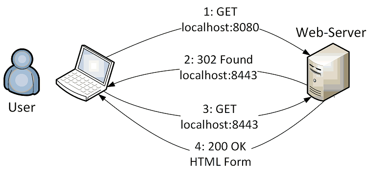
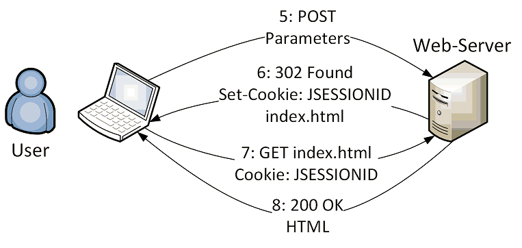

# Form-Based Authentication (Wildfly ApplicationRealm) 

The Java EE security model is declarative. The term declarative here means
that you describe the security roles and permissions in a standard XML descriptor.

The default implementation of the declarative security model is based on Java
**Authentication and Authorization Service (JAAS)** login modules ans subjects.

To show that this **authentication is only handled by the web server**, we only use **static content** in this example.

URL: http://localhost:8080/Wildfly-Authentication-FormBased/

Note that **Wildfly 24** doesn't work properly with JDK 17, thus to run this example **we have to use Java 11**.

## Authentication Sequence



### Step 1 and 2: Redirect HTTP to HTTPS
```
GET /Wildfly-Authentication-FormBased/ HTTP/1.1
Host: localhost:8080
User-Agent: Mozilla/5.0 (X11; Fedora; Linux x86_64; rv:62.0) Gecko/20100101 Firefox/62.0
Accept: text/html,application/xhtml+xml,application/xml;q=0.9,*/*;q=0.8
Accept-Language: en-US,en;q=0.5
Accept-Encoding: gzip, deflate
Connection: close
```
```
HTTP/1.1 302 Found
Connection: close
Location: https://localhost:8443/Wildfly-Authentication-FormBased/
Content-Length: 0
Date: Thu, 25 Apr 2019 15:07:49 GMT
```

### Step 3 and 4: Loading HTML Login Form
```
GET /Wildfly-Authentication-FormBased/ HTTP/1.1
Host: localhost:8443
User-Agent: Mozilla/5.0 (X11; Fedora; Linux x86_64; rv:62.0) Gecko/20100101 Firefox/62.0
Accept: text/html,application/xhtml+xml,application/xml;q=0.9,*/*;q=0.8
Accept-Language: en-US,en;q=0.5
Accept-Encoding: gzip, deflate
Connection: close
```
```
HTTP/1.1 200 OK
Set-Cookie: JSESSIONID=SmvqzauUuavrfTJmjt65MSXMK8HVqD6bMB_K-B1Z.localhost; path=/Wildfly-Authentication-FormBased
Date: Thu, 25 Apr 2019 15:08:24 GMT
Connection: close
Last-Modified: Thu, 25 Apr 2019 15:05:10 GMT
Content-Type: text/html
Content-Length: 910

<!DOCTYPE html PUBLIC "-//W3C//DTD HTML 4.01 Transitional//EN" "http://www.w3.org/TR/html4/loose.dtd">
<html>
<head>
    <title>Login Form</title>
</head>
<body>
	<h2>Login: </h2>
	<form method="post" action="j_security_check" >
		...
		<input type="text" name="j_username" size="20">
		<input type="password" name="j_password" size="20">
		<input type="submit" name="action" value="Login">
		...
	</form>
</body>
</html>
```




### Step 5 and 6: Submit Username and Password, Forward to Requested Page
```
POST /Wildfly-Authentication-FormBased/j_security_check HTTP/1.1
Host: localhost:8443
User-Agent: Mozilla/5.0 (X11; Fedora; Linux x86_64; rv:62.0) Gecko/20100101 Firefox/62.0
Accept: text/html,application/xhtml+xml,application/xml;q=0.9,*/*;q=0.8
Accept-Language: en-US,en;q=0.5
Accept-Encoding: gzip, deflate
Referer: https://localhost:8443/Wildfly-Authentication-FormBased/
Content-Type: application/x-www-form-urlencoded
Content-Length: 50
Cookie: JSESSIONID=SmvqzauUuavrfTJmjt65MSXMK8HVqD6bMB_K-B1Z.localhost
Connection: close

j_username=student&j_password=student&action=Login
```

### Step 6: Forward to Requested HTML Page

```
HTTP/1.1 302 Found
Connection: close
Set-Cookie: JSESSIONID=p0URKOnrkpp_Mq8duvlYRg5I74y4WAQol_D0veGo.localhost; path=/Wildfly-Authentication-FormBased
Location: https://localhost:8443/Wildfly-Authentication-FormBased/index.html
Content-Length: 0
Date: Thu, 25 Apr 2019 15:09:43 GMT
```

### Step 7 and 8: Load Requested HTML Page

```
GET /Wildfly-Authentication-FormBased/index.html HTTP/1.1
Host: localhost:8443
User-Agent: Mozilla/5.0 (X11; Fedora; Linux x86_64; rv:62.0) Gecko/20100101 Firefox/62.0
Accept: text/html,application/xhtml+xml,application/xml;q=0.9,*/*;q=0.8
Accept-Language: en-US,en;q=0.5
Accept-Encoding: gzip, deflate
Referer: https://localhost:8443/Wildfly-Authentication-FormBased/
Cookie: JSESSIONID=p0URKOnrkpp_Mq8duvlYRg5I74y4WAQol_D0veGo.localhost
Connection: close
```

```
HTTP/1.1 200 OK
Date: Thu, 25 Apr 2019 15:09:43 GMT
Connection: close
Last-Modified: Tue, 13 Nov 2018 11:20:02 GMT
Content-Type: text/html
Content-Length: 220

<!DOCTYPE html PUBLIC "-//W3C//DTD HTML 4.01 Transitional//EN" "http://www.w3.org/TR/html4/loose.dtd">
<html>
<head>
    <title>Servlet Authentication Example</title>
</head>
<body>
	<h2>Welcome!</h2>
</body>
</html>
```

## Web Application Configurations

### How to Configure Authentication in the Web Application?

In the given web application, these settings are already done in the `web.xml` file.

In order for a web application to use an authentication mechanism, it must be 
configured to do so inside its deployment descriptor `web.xml`.

This is done by adding `<security-constraint>` and `<login-config>` elements to
the `<web-app>` element.

The `<security-constraint>` element is used to define a portion of the application 
that is restricted to users belonging to a specific role.

The `<url-pattern>` element uses URL pattern matching to determine the protected 
portion of the application.

The `<role-name>` element is used to restrict that portion of the application to
authenticated uses who belong to the `user` role.
```
	<security-constraint>
		<web-resource-collection>
			<web-resource-name>secure</web-resource-name>
			<url-pattern>/*</url-pattern>
		</web-resource-collection>
		<auth-constraint>
			<role-name>user</role-name>
		</auth-constraint>
	</security-constraint>
```
The `<login-config>` element is used to specify how users authenticate with the 
web application.

`<auth-method>` determines which of the authentication mechanisms (`BASIC`, `DIGEST`, 
`FORM`, `CLIENT-CERT`) is used.

`<form-login-config>` identifies which page in the web application is used to 
authenticate the user. No page is configured to be displayed when authentication 
succeeds. Instead, the user is presented with the URL that triggered the 
authentication in the first place.
```
	<login-config>
		<auth-method>FORM</auth-method>
		<form-login-config>
			<form-login-page>/login.html</form-login-page>
			<form-error-page>/error.html</form-error-page>
		</form-login-config>
	</login-config>
```

The web application security model is build around the concept of users and 
roles. Users are assigned to a role, which determines the resources that the
user is allowed to access.

The advantage of roles is that they enable the web application to be configured 
independently of the permissions of the users who access the application.
The actual mapping of users to roles can be specified at deployment time - 
and can be changed dynamically without having to change the application code. 

In our example we add the following elements to the deployment descriptor 
`web.xml`:
```	
	<security-role>
		<role-name>user</role-name>
	</security-role>
``` 

Add the following lines to the `web.xml` configurations to secure the session cookie:
```
    <session-config>
        <cookie-config>
            <http-only>true</http-only>
            <secure>true</secure>
        </cookie-config>
    </session-config>
```

	 
### Authentication Web Form
The **login form** (`login.html`)used to send the credentials to the server must be configured in 
three specific ways:
* The value of its `<form>` element's action attribute must be **j_security_check**
* The username must be sent in a field named **j_username**
* The password must be sent in a field named **j_password**

The **error page** (`error.html`) can contain any HTML that conveys to the user the fact that
the authentication attempt failed.

We can also create a page named `index.html` that contains the main page of the 
application. This page is shown if your authentication is successful. 


## Wildfly Configurations

### Generate ApplicationRealm Credentials for the Wildfly AS

```
$ cd /home/student/local/wildfly-x.y.z.Final/

$ bin/add-user.sh 
What type of user do you wish to add? 
 a) Management User (mgmt-users.properties) 
 b) Application User (application-users.properties)
(a): b

Enter the details of the new user to add.
Using realm 'ApplicationRealm' as discovered from the existing property files.
Username : student

Password recommendations are listed below. To modify these restrictions edit the add-user.properties configuration file.
 - The password should not be one of the following restricted values {root, admin, administrator}
 - The password should contain at least 8 characters, 1 alphabetic character(s), 1 digit(s), 1 non-alphanumeric symbol(s)
 - The password should be different from the username
Password : student
JBAS015269: Password must have at least 8 characters!
Are you sure you want to use the password entered yes/no? yes

Re-enter Password : student 
What groups do you want this user to belong to? (Please enter a comma separated list, or leave blank for none)[  ]: user
About to add user 'student' for realm 'ApplicationRealm'
Is this correct yes/no? yes

Added user 'student' to file '/home/student/install/wildfly-8.2.0.Final/standalone/configuration/application-users.properties'
Added user 'student' to file '/home/student/install/wildfly-8.2.0.Final/domain/configuration/application-users.properties'
Added user 'student' with groups user to file '/home/student/install/wildfly-8.2.0.Final/standalone/configuration/application-roles.properties'
Added user 'student' with groups user to file '/home/student/install/wildfly-8.2.0.Final/domain/configuration/application-roles.properties'

Is this new user going to be used for one AS process to connect to another AS process? 
e.g. for a slave host controller connecting to the master or for a Remoting connection for server to server EJB calls.
yes/no? no
```

```
$ cd local/wildfly-x.y.z.Final/standalone/configuration:
```
``` 
$ cat application-users.properties 
# Properties declaration of users for the realm 'ApplicationRealm' which is the default realm
# for application services on a new installation.
student=82364171bad00c2c933b216cac1001d4
```

```
$ cat application-roles.properties 
# Properties declaration of users roles for the realm 'ApplicationRealm' which is the default realm
# for application services on a new installation.
student=user
```

### Configure ApplicationRealm Authentication for the Wildfly AS

These are the default settings in the `standalone.xml` file.
```
    <management>
        <security-realms>
			...
            <security-realm name="ApplicationRealm">
                <authentication>
                    <local default-user="$local" allowed-users="*" skip-group-loading="true"/>
                    <properties path="application-users.properties" relative-to="jboss.server.config.dir"/>
                </authentication>
                <authorization>
                    <properties path="application-roles.properties" relative-to="jboss.server.config.dir"/>
                </authorization>
            </security-realm>
        </security-realms>
```

## References
* [OWASP: Authentication Cheat Sheet](https://cheatsheetseries.owasp.org/cheatsheets/Authentication_Cheat_Sheet.html)

* Jim Manico, August Detlefsen. **Iron-Clad Java: Build Secure Web Applications**. Oracle Press, 2015
    * Chapter 2: Authentication and Session Management

* Dafydd Stuttard, Marcus Pinto. **The Web Application Hacker’s Handbook**. Wiley, 2nd Edition, 2011
    * Chapter 6: Attacking Authentication

*Egon Teiniker, 2019-2021, GPL v3.0*	
