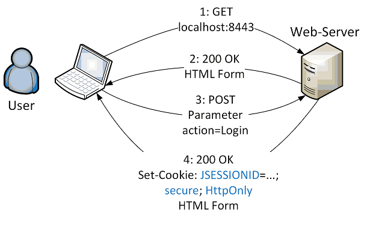
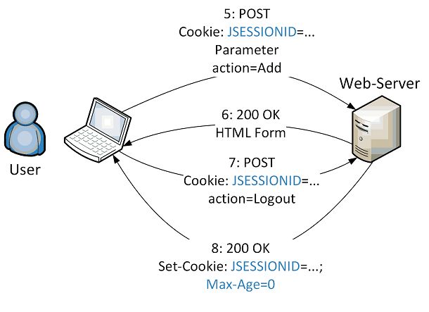

# Servlet Session Management - Shopping Cart (Session ID)

URL: https://localhost:8443/Servlet-SessionManagement-SessionId

In the given `ControllerServlet` a session id based session management has been 
implemented to realize a simple shopping cart which stores a list of products 
into the current session.

The following actions are handled by the `ControllerServlet`:
* Login
	- create a new session
	- create a new List<Product> object and store it in the session object
	- create a message for the web page e.g. "You logged in successfully!"
	
* Logout
	- destroy the current session
	- create a message for the web page e.g. "You logged out successfully!"
	
* Add
	- read the parameters "name" and "quantity"	from the request
	- create a new Product object
	- if there is a valid session, add the new product to the List<Product>
	- create a message for the web page e.g.  "added: 5 cd to the cart"
		
Note that we skip the authentication to make the example simpler.
	
	
## Set the `secure` and `HttpOnly` flag 

Add the following lines to the `web.xml` configurations to secure the session cookie:
```
    <session-config>
        <cookie-config>
            <http-only>true</http-only>
            <secure>true</secure>
        </cookie-config>
    </session-config>
```

## Session Management Sequence



### Step 1 and 2: Load Login Form 
```
GET /Servlet-SessionManagement-SessionId/ HTTP/1.1
Host: localhost:8443
User-Agent: Mozilla/5.0 (X11; Fedora; Linux x86_64; rv:62.0) Gecko/20100101 Firefox/62.0
Accept: text/html,application/xhtml+xml,application/xml;q=0.9,*/*;q=0.8
Accept-Language: en-US,en;q=0.5
Accept-Encoding: gzip, deflate
Connection: close
```

```
HTTP/1.1 200 OK
Connection: close
Content-Type: text/html;charset=ISO-8859-1
Content-Length: 1188
Date: Fri, 26 Apr 2019 14:45:47 GMT

<!DOCTYPE HTML PUBLIC "-//W3C//DTD HTML 4.01 Transitional//EN" "http://www.w3.org/TR/html4/loose.dtd">
<html>
  <head>
  	<title>Simple Shopping Cart</title>
  </head>
  <body>
  ...
```

### Step 3 and 4: Send Login Request and Session Token Generation 
```
POST /Servlet-SessionManagement-SessionId/controller HTTP/1.1
Host: localhost:8443
User-Agent: Mozilla/5.0 (X11; Fedora; Linux x86_64; rv:62.0) Gecko/20100101 Firefox/62.0
Accept: text/html,application/xhtml+xml,application/xml;q=0.9,*/*;q=0.8
Accept-Language: en-US,en;q=0.5
Accept-Encoding: gzip, deflate
Referer: https://localhost:8443/Servlet-SessionManagement-SessionId/
Content-Type: application/x-www-form-urlencoded
Content-Length: 12
Connection: close

action=Login
```

```
HTTP/1.1 200 OK
Connection: close
Set-Cookie: JSESSIONID=O2YjlNA8_gDin1N3hHm8f33H4Mw8UzXxpnSnJeHA.localhost; path=/Servlet-SessionManagement-SessionId; secure; HttpOnly
Content-Type: text/html;charset=ISO-8859-1
Content-Length: 1215
Date: Fri, 26 Apr 2019 14:46:31 GMT

<!DOCTYPE HTML PUBLIC "-//W3C//DTD HTML 4.01 Transitional//EN" "http://www.w3.org/TR/html4/loose.dtd">
<html>
  <head>
  	<title>Simple Shopping Cart</title>
  </head>
  <body>
  ...
```



### Step 5 and 6: POST Request includes Session Token
```
POST /Servlet-SessionManagement-SessionId/controller HTTP/1.1
Host: localhost:8443
User-Agent: Mozilla/5.0 (X11; Fedora; Linux x86_64; rv:62.0) Gecko/20100101 Firefox/62.0
Accept: text/html,application/xhtml+xml,application/xml;q=0.9,*/*;q=0.8
Accept-Language: en-US,en;q=0.5
Accept-Encoding: gzip, deflate
Referer: https://localhost:8443/Servlet-SessionManagement-SessionId/controller
Content-Type: application/x-www-form-urlencoded
Content-Length: 38
Cookie: JSESSIONID=O2YjlNA8_gDin1N3hHm8f33H4Mw8UzXxpnSnJeHA.localhost
Connection: close

name=Exlpoint%21&quantity=3&action=Add
```


```
HTTP/1.1 200 OK
Connection: close
Content-Type: text/html;charset=ISO-8859-1
Content-Length: 1218
Date: Fri, 26 Apr 2019 14:46:51 GMT

<!DOCTYPE HTML PUBLIC "-//W3C//DTD HTML 4.01 Transitional//EN" "http://www.w3.org/TR/html4/loose.dtd">
<html>
  <head>
  	<title>Simple Shopping Cart</title>
  </head>
  <body>
  ...
```

### Step 7 and 8: Logout and Session Invalidation
```
POST /Servlet-SessionManagement-SessionId/controller HTTP/1.1
Host: localhost:8443
User-Agent: Mozilla/5.0 (X11; Fedora; Linux x86_64; rv:62.0) Gecko/20100101 Firefox/62.0
Accept: text/html,application/xhtml+xml,application/xml;q=0.9,*/*;q=0.8
Accept-Language: en-US,en;q=0.5
Accept-Encoding: gzip, deflate
Referer: https://localhost:8443/Servlet-SessionManagement-SessionId/controller
Content-Type: application/x-www-form-urlencoded
Content-Length: 13
Cookie: JSESSIONID=O2YjlNA8_gDin1N3hHm8f33H4Mw8UzXxpnSnJeHA.localhost
Connection: close

action=Logout
```

```
HTTP/1.1 200 OK
Connection: close
Set-Cookie: JSESSIONID=O2YjlNA8_gDin1N3hHm8f33H4Mw8UzXxpnSnJeHA.localhost; path=/Servlet-SessionManagement-SessionId; secure; HttpOnly; Max-Age=0; Expires=Thu, 01-Jan-1970 00:00:00 GMT
Content-Type: text/html;charset=ISO-8859-1
Content-Length: 1216
Date: Fri, 26 Apr 2019 14:46:59 GMT

<!DOCTYPE HTML PUBLIC "-//W3C//DTD HTML 4.01 Transitional//EN" "http://www.w3.org/TR/html4/loose.dtd">
<html>
  <head>
  	<title>Simple Shopping Cart</title>
  </head>
  <body>
  ...
```

## References
* [OWASP: Session Management Cheat Sheet](https://cheatsheetseries.owasp.org/cheatsheets/Session_Management_Cheat_Sheet.html)

* Jim Manico, August Detlefsen. **Iron-Clad Java: Build Secure Web Applications**. Oracle Press, 2015
    * Chapter 2: Authentication and Session Management

* Dafydd Stuttard, Marcus Pinto. **The Web Application Hacker’s Handbook**. Wiley, 2nd Edition, 2011
    * Chapter 7: Attacking Session Management
  
*Egon Teiniker, 2019-2021, GPL v3.0*
	