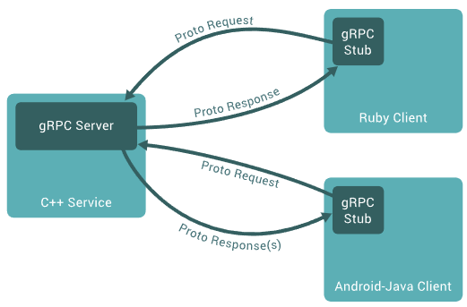

# Microservices using gRPC

**gRPC** is a high performance, open source RPC framework initially developed by Google.
The framework is based on a **client-server model** of remote procedure calls.
A client application can directly call methods on a server application as if it was a local object.

## Introduction
In gRPC, a client application can directly call a method on a server application on a different machine as 
if it were a local object, making it easier for us to create distributed applications and services. 

As in many RPC systems, gRPC is based around the idea of **defining a service**, specifying the methods that 
can be called remotely with their parameters and return types. 

On the **server side**, the server implements this interface and runs a gRPC server to handle client calls. 
On the **client side**, the client has a stub (referred to as just a client in some languages) that provides 
the same methods as the server.

gRPC clients and servers can run and talk to each other in a **variety of environments**.
For example, you can easily create a gRPC server in Java with clients Python or Ruby.

* [Protocol Buffers](ProtocolBuffers.md)

* [Java gRPC API](JavaAPI.md)

* [gRPC Communication Patterns](CommunicationPatterns.md)

## References
* [YouTube: Intro to gRPC](https://youtu.be/3Kkj6vAW5a4)
* [YouTube (Matthias Grüter, Spotify): The Story of Why We Migrate to gRPC and How We Go About It](https://youtu.be/fMq3IpPE3TU)

* [Introduction to gRPC](https://grpc.io/docs/what-is-grpc/introduction/)

* [Core concepts, architecture and lifecycle](https://grpc.io/docs/what-is-grpc/core-concepts/)

*Egon Teiniker, 2016-2022, GPL v3.0*
