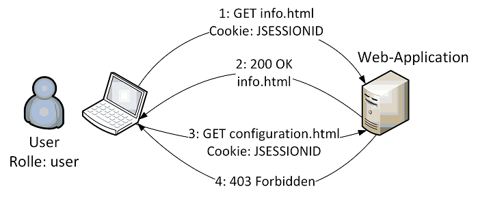

# Access Control with Spring Security

URL: https://localhost:8443/SpringSecurity-AccessControl/

This web application consists only of static HTML pages. 
These pages are arranged according to **roles** (anonymous, user, admin).

```
    src
    ├── main
    │   └── webapp
    │       ├── admin
    │       │   └── configuration.html
    │       ├── public
    │       │   ├── access-denied.html
    │       │   ├── index.html
    │       │   ├── login.html
    │       │   └── welcome.html
    │       ├── user
    │       │   └── info.html
```

## Authorization Sequence



### Step 1 and 2: Authenticated user request the page
A logged in user (`JSESSIONID`) with the assigned role `user` requests the
resource `info.html`

```
GET https://localhost:8443/SpringSecurity-AccessControl/user/info.html HTTP/1.1
Host: localhost:8443
Referer: https://localhost:8443/SpringSecurity-AccessControl/public/login.html
Cookie: JSESSIONID=Zw594dTO5SGFY1piyk_p4XlmvzvLw-SSbCHi_QS0.lab
```

The Web server verifies if the user has an assigned role which **allows to
access the requested resource**. In that case the HTML response will be sent
to the browser.

```
HTTP/1.1 200 OK
Date: Fri, 11 Jun 2021 17:51:24 GMT
Content-Type: text/html
Content-Length: 288

<html>
...
</html>
```

### Step 3 and 4: Authenticated user has no permissions to access a page 
The same user (`JSESSIONID`) requests a resource `configuration.html`

```
GET https://localhost:8443/SpringSecurity-AccessControl/admin/configuration.html HTTP/1.1
Host: localhost:8443
Referer: https://localhost:8443/SpringSecurity-AccessControl/public/index.html
Cookie: JSESSIONID=Zw594dTO5SGFY1piyk_p4XlmvzvLw-SSbCHi_QS0.lab
```

The Web server checks the roles to the requesting user. Now the **user is not
allowed to access the resource** – the request will be rejected (`Forbidden`).

```
HTTP/1.1 403 Forbidden
Date: Fri, 11 Jun 2021 17:51:27 GMT
Content-Type: text/html
Content-Length: 323

<html>
<head>
    <title>Error Page</title>
</head>
<body>
	<h2>Access Denied!</h2>  
    ...
</body>
</html>
```


## Spring Security Configuration 

In this example, the Spring Security module is included as a Servlet Filter in the `web.xml` and configured using a
files called `spring-security.xml`.

### Define Users and Roles
```
<authentication-manager>
    <authentication-provider>
        <password-encoder hash="bcrypt"/>
        <user-service>
            <user name="student" password="$2a$10$rw4FZiFAGyZcwpQYFl0PA.B0WiY3dLoO2/5ypZ5VNF.sUyiYN8TZm" authorities="ROLE_USER" />
            <user name="bart" password="$2a$10$H3y5wnm0gJ2GdL5T5lEH6ev/IroK3bcXMPcGKlsXSFoPwM7.1ts5q" authorities="ROLE_USER" />
            <user name="lisa" password="$2a$10$KUloDm3rBTIFdvItsVZ0aezVPBi73Bq3tU9opT0eS6jbdPJ5Vi52i" authorities="ROLE_USER, ROLE_ADMIN" />
            <user name="burns" password="$2a$10$FpDXVTqXlriWLh3yjoPwO.8kFJDGsiaATcH923v4JY8PN6h98pdai" authorities="ROLE_ADMIN" />
        </user-service>
    </authentication-provider>
</authentication-manager>
```

* `authentication-manager` element: This element is used to configure users, their passwords, and roles in the application. 
    These users will be one who can access the protected parts of the application given they have the appropriate roles. 

* `password-encoder` element: This will register a password encoder bean.  

### Configure Authentication
	
* `<http>` element: The parent of all web-related namespace functionality. 
    Here, we can configure which URLs to intercept, what permissions are required, 
    which type of login to use, and all such configuration.
    * `auto-config`: Setting this attribute to `true` automatically sets up form-login, basic login, and 
        logout functionalities. Spring Security generates them by using standard values and the features enabled.

```
    <http auto-config="true" use-expressions="true">
	<form-login login-page="/public/login.html"/>
	<logout logout-success-url="/public/index.html"/>
	<port-mappings>
		<port-mapping http="8080" https="8443"/>
    	</port-mappings>    
    </http>
```

* `<form-login>`: Provides login form to accept username and password.

* `<logout>`: Handles logout of the application.


### Configure Authorization
```
<http auto-config="true" use-expressions="true">
    <access-denied-handler error-page="/public/access-denied.html" />
    <intercept-url pattern="/public/login.html" access="isAnonymous()"/>
    <intercept-url pattern="/user/**" access="hasAnyRole('USER','ADMIN')" requires-channel="https"/>
    <intercept-url pattern="/admin/**" access="hasRole('ADMIN') and hasIpAddress('127.0.0.1')" requires-channel="https"/>
    ...
</http>		
```

* `<intercept-url>` element: It sets the pattern of the URLs that we want to protecte, using the access attribute.	
	* `access`: It specifies which users are permitted to access the URL specified by the pattern attribute. 
	It is done on the basis of the roles and permissions of a user. 
	
	

## References

* [Spring Security Reference](https://docs.spring.io/spring-security/site/docs/current/reference/html5/)
